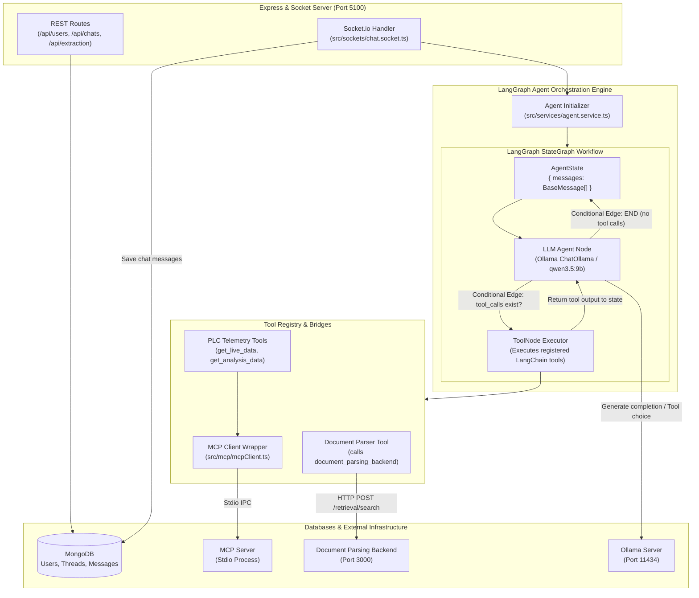

# LangGraph Backend - Application Architecture

This document details the internal architecture, LangGraph state graph design, tool execution engine, and service integrations for **LangGraph Backend**.

---

## 1. Overview & Technology Stack

**LangGraph Backend** serves as the central intelligent orchestration engine for the AI Assistant. It builds stateful, multi-turn conversational agents using **LangGraph**, executes custom tools, interfaces with the **MCP Server** via Stdio, and streams response tokens to the frontend in real time.

- **Runtime**: Node.js with TypeScript (`tsx watch`)
- **Web Framework**: Express.js
- **Agentic Framework**: `@langchain/langgraph` & `@langchain/core`
- **LLM Integration**: `@langchain/ollama`
- **Protocol Client**: `@modelcontextprotocol/sdk` (MCP Stdio Client)
- **Database ORM**: Mongoose (`mongodb`)
- **Real-Time Streaming**: Socket.io Server

---

## 2. Internal Architecture & Agent Graph Diagram



---

## 3. Directory Structure & Key Modules

```
LangGraph_backend/
├── src/
│   ├── agent/               # LangGraph StateGraph definition
│   │   └── agent.ts         # Agent graph creation, node edges, & state schema
│   ├── config/              # Environment & application configurations
│   ├── controllers/         # REST API Controllers (User, Chat, Extraction)
│   ├── db/                  # Mongoose connection & Database Models (User, Chat)
│   ├── mcp/                 # MCP Client connector
│   │   └── mcpClient.ts     # Spawns MCP Server process over Stdio transport
│   ├── routes/              # Express API Routes
│   ├── services/            # Agent lifecycle & Chat business logic
│   ├── sockets/             # Socket.io chat streaming event handlers
│   ├── tools/               # Registered LangChain tools
│   │   ├── tools.ts         # Tool aggregator & dynamic tool loader
│   │   └── documentParserTool.ts
│   ├── utils/               # Ollama model checkers & helpers
│   └── index.ts             # Application entry point & server bootstrap
├── Dockerfile               # Container build configuration
└── package.json             # Node.js dependencies
```

---

## 4. Detailed Component Descriptions

### 4.1 LangGraph StateGraph Execution (`src/agent/agent.ts`)
The core reasoning loop is implemented as a cyclic LangGraph `StateGraph`:
1. **State Definition**: Maintains an array of `BaseMessage` objects containing conversation history and tool outputs.
2. **Agent Node**: Ingests current state messages, invokes `ChatOllama` (`qwen3.5:9b` or `llama3.1:8b`), and determines whether to respond to the user or trigger tool calls.
3. **Tools Node**: Uses LangChain's built-in `ToolNode` to execute function calls requested by the agent (e.g., retrieving live PLC data or searching document manual context).
4. **Looping Edge**: Loops back to the Agent Node until the model produces a final user response without any pending tool calls.

### 4.2 Real-Time Socket.io Token Streaming (`src/sockets/chat.socket.ts`)
Instead of waiting for the full LLM completion:
- The Socket.io handler streams individual generated tokens to the UI as they arrive from Ollama.
- Event sequence: `stream_start` -> `stream_token` (multi-chunk) -> `stream_end`.
- Stores the final combined response into MongoDB upon completion.

### 4.3 MCP Client Integration (`src/mcp/mcpClient.ts`)
- Spawns the **MCP Server** process using `StdioClientTransport`.
- Requests available tools via `mcpClient.listTools()`.
- Dynamically converts MCP tools into LangChain `StructuredTool` instances, allowing LangGraph to execute MCP tools seamlessly.

---

## 5. Applications & External Services Utilized

| Service / Application | Protocol | Address / URI | Purpose |
| :--- | :--- | :--- | :--- |
| **[MCP_Server](file:///c:/Users/Gabriel/Documents/Ai_core_combined/MCP_Server)** | Stdio IPC | Child Process Stdio | Industrial PLC metric polling and time-series telemetry tools. |
| **[document_parsing_backend](file:///c:/Users/Gabriel/Documents/Ai_core_combined/document_parsing_backend)** | HTTP REST | `http://document_parsing_backend:3000` | Semantic document chunk search (`/retrieval/search`) and document processing. |
| **MongoDB** | Mongoose Driver | `mongodb://mongodb:27017/ai-chat` | Persisting user profiles, authentication metadata, chat threads, and message history. |
| **Ollama LLM Engine** | HTTP REST | `http://192.168.2.210:11434` | Text generation models (`qwen3.5:9b`, `llama3.1:8b`, `OLLAMA_DOC_MODEL`). |
