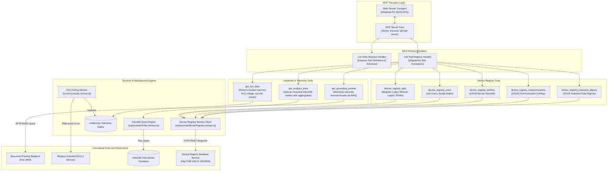

# MCP Server - Application Architecture

This document details the internal architecture, Model Context Protocol (MCP) server implementation, tool definitions, background polling services, database integration, and Device Registry REST API integrations for **MCP Server**.

---

## 1. Overview & Technology Stack

**MCP Server** is a unified industrial integration module implementing Anthropic's **Model Context Protocol (MCP)**. It exposes standardized tools for:
1. Real-time PLC hardware telemetry polling (Modbus RTU / TCP)
2. Historical time-series data analysis (InfluxDB)
3. Document grounding context retrieval (RAG)
4. 3D Model Prompt & Mesh asset generation
5. Device Registry REST API management (`http://192.168.21.108:8000`)

- **Runtime**: Node.js with TypeScript (`ts-node`)
- **Protocol Core**: `@modelcontextprotocol/sdk`
- **Transport Layer**: `StdioServerTransport` (Standard input/output IPC)
- **Industrial Protocol**: `modbus-serial` (Modbus RTU / TCP)
- **Time-Series Client**: `@influxdata/influxdb-client`
- **HTTP Client**: `axios` (HTTPS agent support & JWT cookie handling)
- **Validation**: `zod` schema validation

---

## 2. Internal Architecture Diagram



---

## 3. Directory Structure & Key Modules

```
MCP_Server/
├── src/
│   ├── config/                        # Configuration constants & environment setup
│   ├── services/                      # Background hardware & DB services
│   │   ├── plc.service.ts             # Modbus polling loop & in-memory cache
│   │   ├── influx.service.ts          # InfluxDB flux queries & data formatting
│   │   ├── deviceRegistry.service.ts  # REST API client for Device Registry Service
│   │   ├── blenderScriptBuilder.service.ts # 3D script generation engine
│   │   └── meshAccuracyEvaluator.service.ts# Vision fidelity evaluator
│   ├── tools/                         # Tool schema definitions & helper utilities
│   │   ├── liveData.tool.ts           # Live PLC tool definition
│   │   └── deviceRegistry.tool.ts     # Device Registry tool definitions & dispatcher
│   ├── utils/                         # Modbus & mathematical helper utilities
│   └── index.ts                       # Server entry point, MCP handlers, & stdio connection
├── tsconfig.json                      # TypeScript compiler configuration
└── package.json                       # Node.js dependencies
```

---

## 4. MCP Tools Specification

### 4.1 Hardware & Grounding Tools
- **`get_live_data`**: Real-time PLC electrical metrics (Voltage, Current, Power, Frequency).
- **`get_analysis_data`**: Historical PLC telemetry from InfluxDB with Flux aggregation (`mean`, `sum`, `min`, `max`).
- **`get_grounding_context`**: Semantic manual chunk search via Document Parsing Backend.
- **`generate_3d_prompt`**: CAD specs & Blender python script generation.
- **`generate_3d_mesh`**: Multi-engine 3D asset creation.
- **`evaluate_mesh_accuracy`**: Vision LLM mesh fidelity scoring.

### 4.2 Device Registry REST Tools (`http://192.168.21.108:8000`)
- **`device_registry_auth`**: User registration, login, token refresh, logout, profile (`/api/auth/*`).
- **`device_registry_users`**: User listing & role updates (`/api/users/*`).
- **`device_registry_devices`**: Full CRUD for industrial devices (`/api/devices/*`).
- **`device_registry_communications`**: Full CRUD for communication channels (`/api/communications/*`).
- **`device_registry_industrial_objects`**: Full CRUD for industrial objects & tag mappings (`/api/industrial-objects/*`).

---

## 5. Applications & External Services Utilized

| Service / Infrastructure | Connection Type | Target / Endpoint | Purpose |
| :--- | :--- | :--- | :--- |
| **Industrial PLCs / Equipment** | Modbus RTU / TCP | Serial RS485 / TCP Port 502 | Polling physical electrical sensors (Voltage, Current, Power). |
| **InfluxDB** | Influx Client SDK | InfluxDB Host (`http://localhost:8086`) | Storing and querying historical sensor time-series metrics. |
| **[document_parsing_backend](file:///c:/Users/Gabriel/Documents/Ai_core_combined/document_parsing_backend)** | HTTP REST | `http://document_parsing_backend:3000/retrieval/search` | Document RAG retrieval for semantic manual chunk lookups. |
| **[Device Registry Service](http://192.168.21.108:8000)** | HTTP REST | `http://192.168.21.108:8000` | Device, user, communication, and industrial object registry management. |
| **[LangGraph_backend](file:///c:/Users/Gabriel/Documents/Ai_core_combined/LangGraph_backend)** | Stdio IPC | Standard Input/Output | Host application invoking MCP tools via JSON-RPC. |
