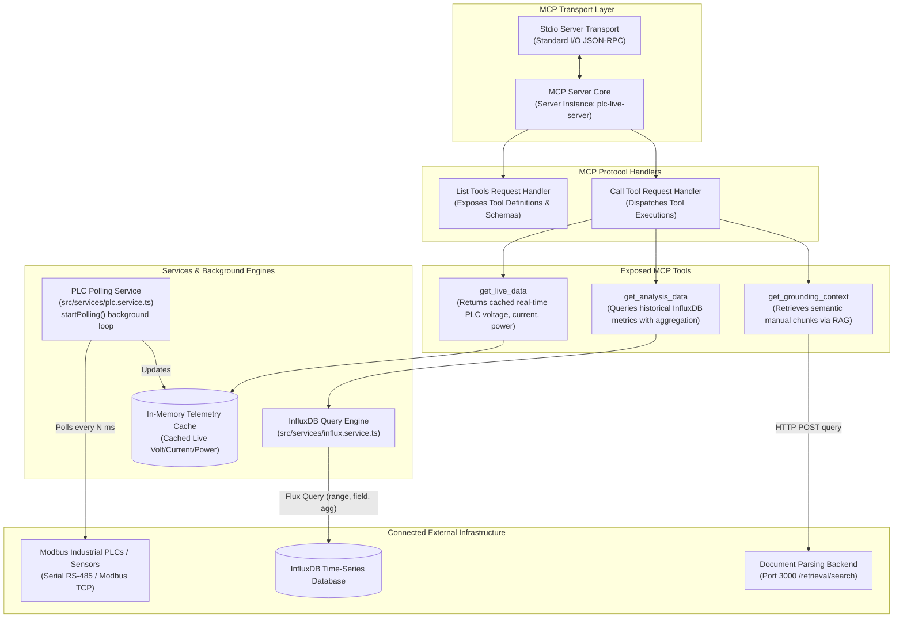

# MCP Server - Application Architecture

This document details the internal architecture, Model Context Protocol (MCP) server implementation, tool definitions, background polling services, and database integration for **MCP Server**.

---

## 1. Overview & Technology Stack

**MCP Server** is an industrial integration module implementing Anthropic's **Model Context Protocol (MCP)**. It exposes standardized tools for querying live PLC hardware metrics, historical time-series data, and document grounding context.

- **Runtime**: Node.js with TypeScript (`ts-node`)
- **Protocol Core**: `@modelcontextprotocol/sdk`
- **Transport Layer**: `StdioServerTransport` (Standard input/output IPC)
- **Industrial Protocol**: `modbus-serial` (Modbus RTU / TCP)
- **Time-Series Client**: `@influxdata/influxdb-client`
- **Validation**: `zod` schema validation

---

## 2. Internal Architecture Diagram



---

## 3. Directory Structure & Key Modules

```
MCP_Server/
├── src/
│   ├── config/              # Configuration constants & environment setup
│   ├── services/            # Background hardware & DB services
│   │   ├── plc.service.ts   # Modbus polling loop & in-memory cache
│   │   └── influx.service.ts# InfluxDB flux queries & data formatting
│   ├── tools/               # Tool schema definitions & helper utilities
│   ├── utils/               # Modbus & mathematical helper utilities
│   └── index.ts             # Server entry point, MCP handlers, & stdio connection
├── tsconfig.json            # TypeScript compiler configuration
└── package.json             # Node.js dependencies
```

---

## 4. MCP Tools Specification

### 4.1 `get_live_data`
- **Description**: Returns exact numeric real-time PLC electrical measurements (Voltage in Volts, Current in Amps, Power in kW, Frequency in Hz).
- **Execution**: Reads instantly from `TelemetryCache` updated continuously by `plc.service.ts` without blocking.
- **Parameters**: None.

### 4.2 `get_analysis_data`
- **Description**: Queries historical PLC telemetry from **InfluxDB**.
- **Parameters**:
  - `range` (string, required): Time duration (e.g. `"1h"`, `"24h"`, `"7d"`).
  - `field` (string, optional): Specific metric field (e.g. `"voltage"`, `"current"`, `"power"`).
  - `aggregation` (string, optional): Aggregation method (`"mean"`, `"sum"`, `"min"`, `"max"`).
- **Execution**: Constructs a Flux query executed against **InfluxDB**.

### 4.3 `get_grounding_context`
- **Description**: Retrieves relevant manual chunks and grounding documentation context for user questions.
- **Parameters**:
  - `query` (string, required): Search query phrase.
- **Execution**: Performs an HTTP POST request to `http://document_parsing_backend:3000/retrieval/search`.

---

## 5. Applications & External Services Utilized

| Service / Infrastructure | Connection Type | Target / Endpoint | Purpose |
| :--- | :--- | :--- | :--- |
| **Industrial PLCs / Equipment** | Modbus RTU / TCP | Serial RS485 / TCP Port 502 | Polling physical electrical sensors (Voltage, Current, Power). |
| **InfluxDB** | Influx Client SDK | InfluxDB Host (`http://localhost:8086`) | Storing and querying historical sensor time-series metrics. |
| **[document_parsing_backend](file:///c:/Users/Gabriel/Documents/Ai_core_combined/document_parsing_backend)** | HTTP REST | `http://document_parsing_backend:3000/retrieval/search` | Document RAG retrieval for semantic manual chunk lookups. |
| **[LangGraph_backend](file:///c:/Users/Gabriel/Documents/Ai_core_combined/LangGraph_backend)** | Stdio IPC | Standard Input/Output | Host application invoking MCP tools via JSON-RPC. |
