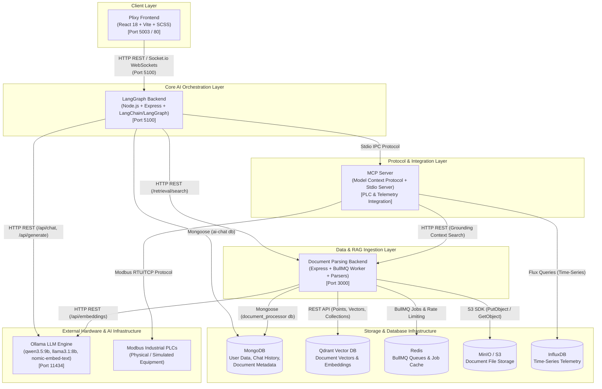
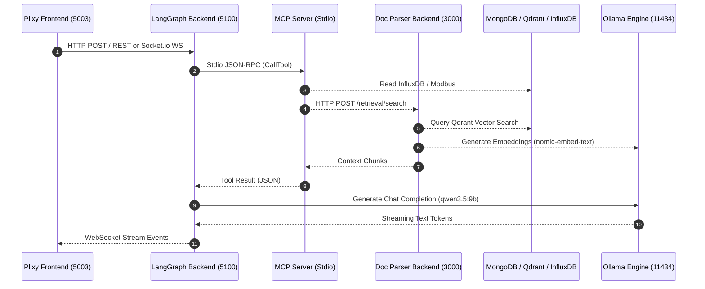

# Overall System Architecture

This document provides a comprehensive overview of the **AI Industrial Assistant Platform**, outlining the multi-tier system topology, application boundaries, data flows, inter-service communications, and external infrastructure integrations.

---

## 1. System Overview & Architecture Diagram

The platform consists of four primary application modules working together to provide real-time industrial monitoring, intelligent document grounding (RAG), and conversational AI capabilities powered by local LLMs and agentic graphs.

---

## 2. Component & Application Matrix

| Application Name | Tech Stack | Role & Responsibilities | Key Dependencies & Services Utilized |
| :--- | :--- | :--- | :--- |
| **[Plixy_frontend](file:///c:/Users/Gabriel/Documents/Ai_core_combined/Plixy_frontend)** | React 18, Vite, TypeScript, SCSS, Socket.io Client, Axios | User Interface for AI Assistant, chat streaming, user authentication, file uploads, and live PLC metric dashboards. | `LangGraph_backend` (Port 5100 via REST & Socket.io) |
| **[LangGraph_backend](file:///c:/Users/Gabriel/Documents/Ai_core_combined/LangGraph_backend)** | Node.js, TypeScript, Express, LangGraph, LangChain, Socket.io | Orchestrates conversational agent state graphs, manages tools, executes MCP tools, streams tokens to UI. | `MCP_Server` (Stdio), `document_parsing_backend`, `MongoDB`, `Ollama` |
| **[MCP_Server](file:///c:/Users/Gabriel/Documents/Ai_core_combined/MCP_Server)** | Node.js, TypeScript, @modelcontextprotocol/sdk, Modbus-Serial | Provides standardized Model Context Protocol tools (`get_live_data`, `get_analysis_data`, `get_grounding_context`). | `Modbus PLCs`, `InfluxDB`, `document_parsing_backend` |
| **[document_parsing_backend](file:///c:/Users/Gabriel/Documents/Ai_core_combined/document_parsing_backend)** | Node.js, Express, TypeScript, BullMQ, Parsers (PDF/DOCX/CSV/XLSX/OCR) | Multi-format document ingestion pipeline, text chunking, embedding generation, vector indexing, and RAG retrieval. | `Redis`, `MongoDB`, `Qdrant`, `MinIO`, `Ollama` |

---

## 3. End-to-End User Interaction Workflows

### 3.1 Conversational Query with Real-Time PLC Telemetry
1. **User** submits a query on **Plixy Frontend** (e.g., *"What is the current voltage and power trend over the last hour?"*).
2. **Plixy Frontend** transmits the request to **LangGraph Backend** via Socket.io WebSocket connection.
3. **LangGraph Backend** invokes the LangGraph Agent Graph:
   - The LLM node evaluates the user prompt and decides to execute tools.
   - **LangGraph Backend** dispatches tool requests to **MCP Server** over Stdio:
     - `get_live_data` -> reads cached live PLC metrics from background Modbus polling engine.
     - `get_analysis_data` -> queries **InfluxDB** time-series database for 1-hour metrics.
4. **MCP Server** returns raw precise numerical data to **LangGraph Backend**.
5. **LangGraph Backend** passes data back to the Ollama LLM (`qwen3.5:9b`) to synthesize a structured response.
6. Token stream is pushed real-time to **Plixy Frontend** over WebSockets.

### 3.2 Document Upload & RAG Retrieval
1. **User** uploads a PDF/DOCX manual on **Plixy Frontend** or **Document Parsing Backend**.
2. **Document Parsing Backend** receives the file via Express REST endpoint `/parsing`:
   - Saves original binary file to **MinIO S3** bucket (`ai-upload-doc`).
   - Enqueues parsing job into **Redis (BullMQ)**.
3. **BullMQ Worker** picks up job:
   - Extracts raw text using specific parser (`pdf-parse`, `mammoth`, `xlsx`, etc.).
   - Splits text using configured chunking strategy (e.g. hierarchical/semantic).
   - Generates 768-dimensional embeddings via **Ollama** (`nomic-embed-text`).
   - Stores vectors and payload metadata into **Qdrant** collection `documents`.
   - Saves document metadata record in **MongoDB** (`document_processor` database).
4. When a user asks questions about the manual, **LangGraph Backend** / **MCP Server** calls **Document Parsing Backend** (`/retrieval/search`), searching **Qdrant** for relevant context chunks to ground the LLM's answer.

---

## 4. Communication Protocols & Ports

| Source Application | Destination | Protocol | Default Port / Endpoint | Description |
| :--- | :--- | :--- | :--- | :--- |
| `Plixy_frontend` | `LangGraph_backend` | HTTP / WebSocket | `http://localhost:5100` | Chat streaming, user auth, thread management |
| `LangGraph_backend` | `MCP_Server` | Stdio IPC | Standard I/O (JSON-RPC) | Model Context Protocol tool execution |
| `LangGraph_backend` | `document_parsing_backend` | HTTP REST | `http://localhost:3000` | Direct document parsing & semantic RAG retrieval |
| `LangGraph_backend` | `Ollama` | HTTP REST | `http://192.168.2.210:11434` | Chat completion models (`qwen3.5:9b`, `llama3.1:8b`) |
| `MCP_Server` | `document_parsing_backend` | HTTP REST | `http://localhost:3000/retrieval/search` | Grounding context retrieval |
| `MCP_Server` | `InfluxDB` | Flux / HTTP | `8086` | Historical telemetry analytics queries |
| `MCP_Server` | `PLCs` | Modbus RTU/TCP | Serial / TCP 502 | Industrial sensor polling |
| `document_parsing_backend` | `Qdrant` | REST / gRPC | `http://localhost:6333` | Vector embedding storage & similarity search |
| `document_parsing_backend` | `Redis` | Redis Protocol | `localhost:6379` | BullMQ async task processing queue |
| `document_parsing_backend` | `MinIO` | S3 API | `http://192.168.2.213:9998` | Raw document object storage |
