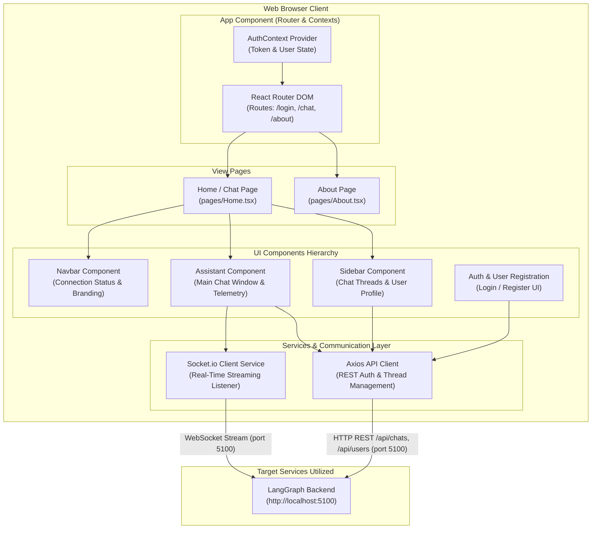
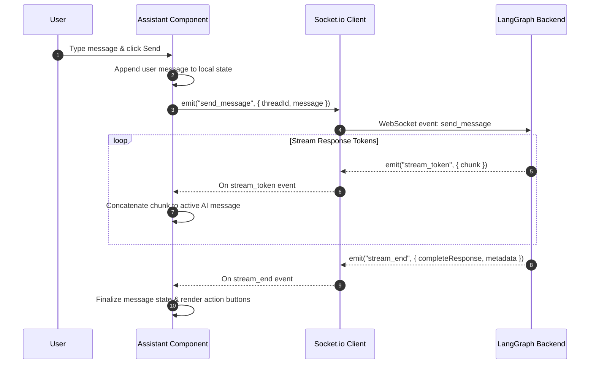

# Plixy Frontend - Application Architecture

This document details the internal architecture, UI component structure, state management, and external service communications for **Plixy Frontend**.

---

## 1. Overview & Technology Stack

**Plixy Frontend** is a modern React web application providing a responsive, real-time conversational interface for the AI Industrial Assistant.

- **Framework**: React 18 with TypeScript
- **Build System**: Vite 5
- **Styling**: SCSS Modules (Modular CSS styling)
- **Routing**: React Router DOM v6
- **Real-Time Communication**: Socket.io Client (`socket.io-client`)
- **HTTP Client**: Axios
- **Module Federation**: `@originjs/vite-plugin-federation` (Supports micro-frontend integration)

---

## 2. Internal Architecture Diagram



---

## 3. Directory Structure & Key Components

```
Plixy_frontend/
├── src/
│   ├── assets/              # Static media assets & icons
│   ├── components/
│   │   ├── Assistant/       # Core Chat Interface & Streaming Renderer
│   │   │   ├── Assistant.tsx
│   │   │   └── Assistant.module.scss
│   │   ├── Auth/            # Authentication UI & Context
│   │   ├── Navbar/          # Global Header Navigation
│   │   ├── Sidebar/         # Dynamic Thread History & Navigation
│   │   ├── UserRegistration/# User management & registration forms
│   │   └── common/          # Reusable Buttons, Inputs, Loaders
│   ├── hooks/               # Custom React hooks (useSocket, useAuth)
│   ├── pages/               # Top-level Page Views (Home, About)
│   ├── services/            # API clients (api.ts, auth.ts, chat.ts)
│   ├── styles/              # Global variables, mixins, & resets
│   ├── App.tsx              # Root React component
│   └── main.tsx             # DOM Mount Entry Point
├── vite.config.ts           # Vite build config & Module Federation setup
└── nginx.conf               # Docker production Nginx web server config
```

---

## 4. Key UI Workflows & State Management

### 4.1 Real-Time Streaming Chat Workflow


### 4.2 Authentication & Route Protection
- **JWT Handling**: Auth state is maintained via standard JWTs stored in local storage and managed by `AuthContext`.
- **API Interceptor**: `services/api.ts` automatically attaches `Authorization: Bearer <token>` headers to outgoing HTTP requests targeting `LangGraph_backend`.

---

## 5. External Services & Applications Utilized

| External Application / Service | Connection Protocol | Endpoint / Target | Purpose |
| :--- | :--- | :--- | :--- |
| **[LangGraph_backend](file:///c:/Users/Gabriel/Documents/Ai_core_combined/LangGraph_backend)** | HTTP REST | `http://localhost:5100/api/users`<br>`http://localhost:5100/api/chats` | User login/signup, creating chat threads, retrieving thread history. |
| **[LangGraph_backend](file:///c:/Users/Gabriel/Documents/Ai_core_combined/LangGraph_backend)** | WebSocket (Socket.io) | `ws://localhost:5100` | Bidirectional real-time token streaming and agent status updates. |
