# Development Timeline & Task Breakdown

This document provides a detailed, granular record of features, development tasks, and execution hours for the **Document Ingestion & Parsing Backend**, **LangGraph AI Orchestration Backend**, **MCP Server**, and the **Real-Time Ingestion Tracking & 3D Prompt Synthesis Module**. 

---

## 📊 Summary of Development Effort

| Module | Scope / Key Focus Areas | Dev Hours |
| :--- | :--- | :--- |
| **1. Document Ingestion & Parsing Backend** | API, Queues (BullMQ/Redis), Parsers, OCR, Chunking Strategies, Vector DB (Qdrant), RAG Retrieval API, Health Diagnostics | **128 Hours** |
| **2. LangGraph AI & Agent Backend** | LangGraph State Graphs, Router / Specialist Nodes, MCP Client integration, WebSockets (Socket.io) streaming, Ollama title gen, ETA estimation | **96 Hours** |
| **3. MCP Server & Industrial Integrations** | STDIO transport, InfluxDB historical query engine, live PLC telemetry simulator | **16 Hours** |
| **4. Real-Time Ingest Tracking & 3D Prompt Synthesis** | Socket.io progress channels, multi-stage extraction pipeline trackers (Document Analysis, Device Info, Dimensions, I/O), prompt generation engine | **44 Hours** |
| **Total Project Effort** | **Core Backend Pipeline (Excluding Frontend)** | **284 Hours** |

---

## 📅 Chronological Gantt Diagram

```mermaid
gantt
    title IIoT Backend Pipeline Development Timeline (284 Hours Total)
    dateFormat X
    axisFormat %d
    
    section Document Parsing Backend
    Env, DB & Logger Setup           :active, task1, 0, 12
    BullMQ & Queue Ingestion         :task2, 12, 28
    Parser Registry & OCR Fallback   :task3, 28, 52
    Semantic Chunking Engine         :task4, 52, 70
    OpenAI Embeddings & Qdrant Sync  :task5, 70, 84
    RAG Search & Ask Routes          :task6, 84, 100
    Health Monitoring & Test Suite   :task7, 100, 128
    
    section LangGraph Agent Backend
    WS Server & Mongo Chat History   :task8, 128, 140
    LangGraph Graph Design & Prompts :task9, 140, 160
    MCP Client & Subprocess Launcher :task10, 160, 176
    Websocket Token Stream & ETA    :task11, 176, 192
    Ollama & Title Generation        :task12, 192, 207
    
    section MCP Server
    STDIO server & Live PLC Polling  :task13, 207, 223
    InfluxDB Query Services          :task14, 223, 240
    
    section Real-time Tracking & Prompt Gen
    Socket.io Progress Engine        :task15, 240, 252
    Extraction Pipeline Stages       :task16, 252, 272
    3D Asset Prompt Synthesis        :task17, 272, 284
```

---

## 🛠️ Granular Features & Task Breakdown

### 📂 Module 1: Document Processing & RAG Backend (`document_parsing_backend`)
**Total Time:** 128 Hours

This backend is responsible for receiving multi-format manuals, parsing them in a resource-safe way via BullMQ background queues, vectorizing, and syncing them into Qdrant for semantic search.

#### **Feature 1: System Infrastructure & Diagnostic Layer** (12 Hours)
*System setup, environment variable configuration, schema modeling, and correlation-aware logging.*
* **Task 1.1.1 (2 hrs):** Project bootstrapping: tsconfig compilation settings, directories layout, ESLint/Prettier configuration, and core package dependencies.
* **Task 1.1.2 (3 hrs):** Build runtime validation for configuration settings using `Zod` schemas to enforce crash-on-start patterns if keys are invalid.
* **Task 1.1.3 (4 hrs):** Configure structured `Winston` JSON logging and implement Express correlation tracking middleware using Node’s `AsyncLocalStorage` to enable request tracing.
* **Task 1.1.4 (3 hrs):** Design Mongoose models for `Document` ingestion states and `Chunk` records including storage configuration rules.

#### **Feature 2: Multi-Stage Asynchronous Queue Ingestion Pipeline** (16 Hours)
*Resilient processing queue infrastructure utilizing BullMQ and Redis to separate chunking, embedding, and vector synchronization.*
* **Task 1.2.1 (4 hrs):** Initialize Redis connection pooling and define robust BullMQ queue managers with retry/backoff presets.
* **Task 1.2.2 (6 hrs):** Write the sequential queue handler logic: passing job payloads, serial tracking, progress reporting, and state updates from enqueued to processed.
* **Task 1.2.3 (6 hrs):** Integrate graceful shutdown listeners (`SIGTERM`/`SIGINT`) into BullMQ worker threads, guaranteeing zero job state loss during deployments.

#### **Feature 3: Document Parsing Engine** (24 Hours)
*A registry-driven document parsing engine capable of handling standard unstructured and tabular industrial data formats.*
* **Task 1.3.1 (4 hrs):** Implement the `DocumentParser` interface, factory controller, and parser strategy registry.
* **Task 1.3.2 (14 hrs):** Implement specialized extraction strategies:
  * **PDF Parser:** Extraction of text layers, metadata, and page layouts.
  * **Tabular Parsers:** Structured cell/row extraction for CSV and Excel (XLSX).
  * **Text/Web/Document Parsers:** Clean formatting tools for TXT, Markdown, HTML, JSON, XML, DOCX, and PPTX.
* **Task 1.3.3 (6 hrs):** Integrate Tesseract OCR fallback pipelines to process embedded scanned text, tables, and device images.

#### **Feature 4: Semantic Chunking Engine** (18 Hours)
*Content chunking strategies tailored to technical documentation.*
* **Task 1.4.1 (10 hrs):** Implement specialized chunking strategies:
  * **Heading Chunking:** Splitting documents by header structure to maintain local contextual blocks.
  * **Table Chunking:** Retaining intact matrix data structures to prevent parsing fragmentation.
  * **Paragraph Chunking:** Traditional sliding-window paragraph slicing.
  * **Image/Structured Data Chunking:** Extracting metadata references for diagrams or technical parameters.
* **Task 1.4.2 (8 hrs):** Implement word/sentence counting, overlapping token window boundaries, and character validation utilities.

#### **Feature 5: Vector Generation & Vector DB Ingestion** (14 Hours)
*Generating semantic embeddings and synchronizing vectors with Qdrant.*
* **Task 1.5.1 (6 hrs):** Build OpenAI API service integrations mapping text batches to `text-embedding-3-small` with error handlers, rate-limit retries, and timeouts.
* **Task 1.5.2 (8 hrs):** Build the Vector Sync Worker to batch-upsert semantic float arrays and associated metadata payloads into Qdrant vector collections.

#### **Feature 6: Retrieval & RAG API Layer** (16 Hours)
*Exposing high-performance query endpoints for search and question-answering workflows.*
* **Task 1.6.1 (6 hrs):** Code `/retrieval/search` route to execute semantic searches in Qdrant, supporting similarity threshold boundaries and custom filter parameters.
* **Task 1.6.2 (10 hrs):** Develop the `/rag/ask` endpoint: retrieve relevant manual context, structure context payloads into prompting templates, invoke the LLM, and parse responses.

#### **Feature 7: Diagnostics, Metrics & Swagger Interface** (28 Hours)
*API documentation and operational observability metrics.*
* **Task 1.7.1 (8 hrs):** Write custom diagnostic endpoints: `/health/live` (basic check) and `/health/ready` (validating connections to Redis, MongoDB, Qdrant, and OpenAI).
* **Task 1.7.2 (8 hrs):** Implement `/health/metrics` monitoring controller: tracking memory, CPU loads, queue lengths, latency histograms, and ingestion rates.
* **Task 1.7.3 (6 hrs):** Setup Swagger/OpenAPI specifications, embedding auth tokens, request-response schemas, and interactive test endpoints.
* **Task 1.7.4 (6 hrs):** Formulate unit/integration test suites using Mocha/Chai/Supertest to validate parsing workflows and system endpoints.

---

### 🤖 Module 2: AI Logic & Agent Backend (`LangGraph_backend`)
**Total Time:** 96 Hours

This backend runs the core AI decision-making loops (via LangGraph), routes queries, connects to the frontend using WebSockets, and integrates with the MCP server to invoke tool schemas.

#### **Feature 1: Gateway Server & Socket.io Architecture** (12 Hours)
*Real-time user sessions, chat caching, and websocket connection management.*
* **Task 2.1.1 (3 hrs):** Build Express project boilerplate, routes mapping, and error-handling middlewares.
* **Task 2.1.2 (5 hrs):** Initialize Socket.io server layer to handle connection events, chat joining, and socket authentication.
* **Task 2.1.3 (4 hrs):** Wire Mongoose models for Chat History and user session persistence.

#### **Feature 2: LangGraph Orchestration & Decision Engine** (20 Hours)
*Graph-based AI state machines that handle context retrieval and tool execution routing.*
* **Task 2.2.1 (8 hrs):** Implement the `StateGraph` model defining execution nodes, graph state types, and transitional edges.
* **Task 2.2.2 (6 hrs):** Design the **Fast Intent Router** (evaluating input triggers to direct tasks to specialized agents) and the conditional edge loops.
* **Task 2.2.3 (6 hrs):** Write the specialized prompt configurations:
  * **Document RAG Specialist Node:** Instructing grounding rules, tabular outputs, parallel tool calls, and diagram formatting rules.
  * **PLC Specialist Node:** Instructing configuration schemas and database writing guidelines.

#### **Feature 3: Model Context Protocol (MCP) Client Manager** (16 Hours)
*Dynamic runtime tool-loading framework communicating with external servers.*
* **Task 2.3.1 (4 hrs):** Implement standard MCP client connections, protocol synchronization, and handshake controls.
* **Task 2.3.2 (6 hrs):** Develop the Stdio Subprocess Spawner to manage the lifespan of the MCP Server.
* **Task 2.3.3 (6 hrs):** Build the tool mapping middleware: dynamically translate MCP tools into LangChain Runnable Tool schemas at startup.

#### **Feature 4: Streaming Engine & WebSocket UI Handlers** (16 Hours)
*Real-time token streaming and diagnostic event emissions.*
* **Task 2.4.1 (6 hrs):** Write the stream iterator wrapping `executor.stream` to capture token chunks and immediately emit them via `stream` socket events.
* **Task 2.4.2 (6 hrs):** Code event dispatchers notifying the UI of background tool calls (e.g. `get_grounding_context`) to update client-side progress meters.
* **Task 2.4.3 (4 hrs):** Configure proxy middlewares in Express to redirect static upload assets from the document parsing backend directly to the frontend.

#### **Feature 5: Response Analytics & Ollama Services** (16 Hours)
*Response optimization features running locally and historically.*
* **Task 2.5.1 (6 hrs):** Integrate local/remote Ollama connection endpoints for running `qwen3.5:9b` to generate 3-4 word abstract chat titles based on first-turn message content.
* **Task 2.5.2 (6 hrs):** Develop the smart ETA predictor service: aggregate Mongoose execution durations to return averages, falling back to heuristics based on input keyword structures.
* **Task 2.5.3 (4 hrs):** Set up execution timeouts, model fallback logic, and network failure safeguards.

#### **Feature 6: Integration Testing & Verification** (16 Hours)
*System-wide validation of real-time communication pipelines.*
* **Task 2.6.1 (8 hrs):** Implement mock MCP server mocks to test agent execution under standard user flows.
* **Task 2.6.2 (8 hrs):** Build automated socket connection clients to simulate multi-user chat sessions, streaming tokens, and title generation under load.

---

### 🔌 Module 3: MCP Server & Integrations (`MCP_Server`)
**Total Time:** 16 Hours

The Model Context Protocol Server exposes database wrappers and hardware diagnostic pipelines.

#### **Feature 1: MCP STDIO Protocol Interface** (4 Hours)
*Setting up standardized MCP SDK interfaces.*
* **Task 3.1.1 (2 hrs):** Setup Model Context Protocol SDK server boilerplate and Stdio Transport configurations.
* **Task 3.1.2 (2 hrs):** Define JSON schemas for inputs and output types of the registry tools.

#### **Feature 2: Database & Telemetry Services** (12 Hours)
*Database engines and metrics simulators.*
* **Task 3.2.1 (6 hrs):** Build the InfluxDB client connection service to execute historical time-series queries for `get_analysis_data` tool calls.
* **Task 3.2.2 (6 hrs):** Code the background polling service for `get_live_data` to simulate industrial PLC voltage, current, power, and frequency telemetry.

---

### ⚡ Module 4: Real-Time Ingest Tracking & 3D Prompt Synthesis (`ingest_tracking_prompt_gen`)
**Total Time:** 44 Hours

This module implements the integration between the document ingestion pipeline and the user interface. It focuses on emitting real-time event status updates over Socket.io for each phase of document analysis, executing the specific semantic extractions (Device Specs, Dimensions, I/O mapping), and compiling the outputs into an optimized LLM prompt for generating structural 3D models.

#### **Feature 1: Real-time Progress Tracking & WebSocket Event Dispatcher** (12 Hours)
*Setting up the backend-to-frontend live event stream via Socket.io to inform the UI of ingestion stages.*
* **Task 4.1.1 (3 hrs):** Define the Socket.io data schema and event structures (`pipeline:status`, `pipeline:error`, `pipeline:complete`) to convey state-updates and extracted data in real time.
* **Task 4.1.2 (3 hrs):** Build Socket.io room orchestration logic to target progress notifications to specific user project rooms (e.g. `room:project_manual_[documentId]`).
* **Task 4.1.3 (3 hrs):** Integrate progress emitter hooks in the BullMQ ingestion queues (`document`, `embedding`, `vector_sync`) and the extraction specialists to publish progress percentages and completion states.
* **Task 4.1.4 (3 hrs):** Implement database caching for the active pipeline extraction state in MongoDB to support connection recovery and page refreshes.

#### **Feature 2: Multi-Stage Document Extraction Pipeline** (20 Hours)
*Implementing the targeted parsers and models to extract precise parameters corresponding to the live pipeline tasks.*
* **Task 4.2.1 (4 hrs):** **Document Analysis Stage:** Write strategies to identify layout structure, Table of Contents, schematics/dimensions indexes, and count page lengths.
* **Task 4.2.2 (5 hrs):** **Device Information Stage:** Configure structured LLM/text extraction schemas to parse `Manufacturer`, `Model`, and nominal parameters (e.g. `Payload` rating).
* **Task 4.2.3 (5 hrs):** **Dimensions & Work Envelope Stage:** Configure extractors to target physical sizes (height, width, depth, reach radius) and mechanical envelopes from specification pages.
* **Task 4.2.4 (6 hrs):** **I/O & Address Map Stage:** Implement specialized extraction logic (e.g., regex pattern matching combined with LLM prompting) to compile device analog/digital input/output signals and hardware registers (e.g., Modbus/PLC).

#### **Feature 3: 3D Asset Prompt Synthesis Engine** (12 Hours)
*Aggregating extracted hardware characteristics to construct a high-fidelity prompt template that drives external 3D generation tools.*
* **Task 4.3.1 (4 hrs):** Design structural prompt template generators that synthesize model data, shape rules, dimensions, connector locations, and I/O layout specifications into structured markdown/JSON prompts.
* **Task 4.3.2 (4 hrs):** Build LLM post-processing controller (using OpenAI or local Ollama) to sanitize extracted specs and optimize description language for stable 3D meshes generation.
* **Task 4.3.3 (4 hrs):** Develop `/documents/:id/3d-prompt` GET/POST endpoints to review, manual-override, and approve the generated prompt text alongside its raw specs.

---

## 📈 Rationale Behind Estimates

> [!NOTE]
> **Queue Resilience (BullMQ / Redis):**
> Setting up BullMQ is relatively straightforward, but implementing bulletproof workers that handle connection drops, process signals (`SIGTERM`), and coordinate progress reporting requires significant error-handling and testing time.

> [!TIP]
> **Custom File Parsers & OCR:**
> Multi-format document parsing is highly error-prone (especially with formatting variations in PDF tables, Excel sheets, and complex DOCX layouts). The timeline allocates **24 hours** to ensure parser reliability, OCR coverage, and formatting preservation.

> [!IMPORTANT]
> **LangGraph Decision & Stream Orchestration:**
> Streaming tokens while concurrently report active tool invocations over WebSockets requires precise event timing to avoid UI state glitches. **36 hours** are dedicated specifically to state graph configuration, routing, and WebSocket streaming.

> [!TIP]
> **Real-Time Extraction Feedback (Module 4):**
> Synchronizing background database operations with live Socket.io events ensures that the frontend updates its extraction tasks list immediately (matching the checklist behavior in the UI screenshots). Allocating **44 hours** allows for robust error handling, data schema validations, and state synchronization across multiple worker nodes.
