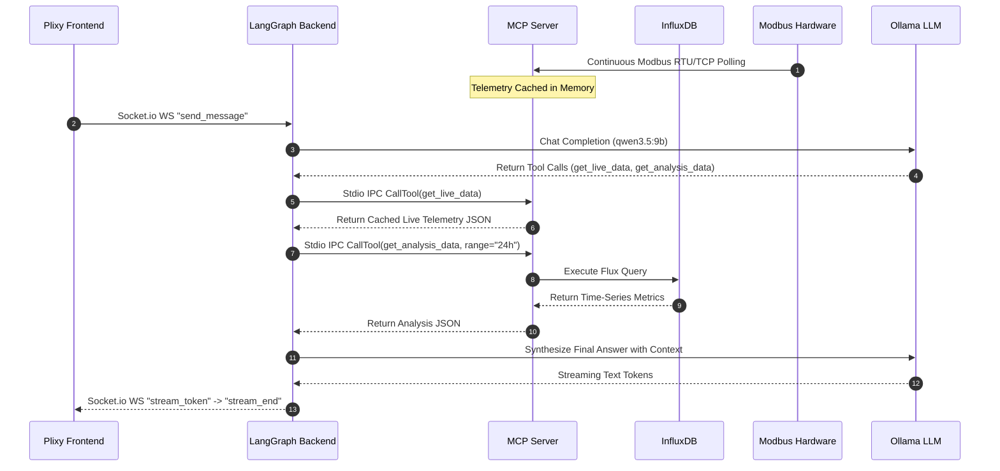
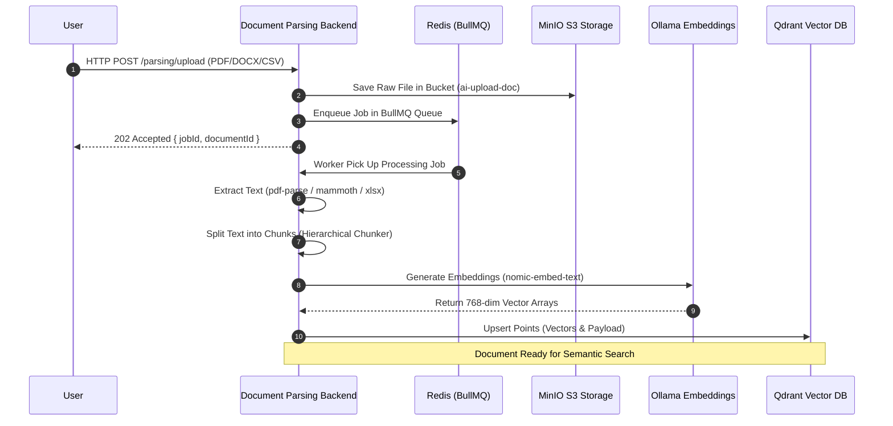

# Master Overall System Architecture

This document presents the complete end-to-end system architecture for the **AI Industrial Assistant Platform**. It contains a comprehensive, macro-to-micro system architecture diagram that details every application, internal module, background worker, database, hardware interface, and basic-level data flow.

---

## 1. Master System Architecture Diagram

Below is the complete architectural map showing all 4 main applications, their internal sub-modules, databases, background engines, protocols, and data flows.

```mermaid
flowchart TB
    %% ==========================================
    %% CLIENT LAYER: PLIXY FRONTEND
    %% ==========================================
    subgraph APP1 ["Plixy Frontend (React 18 + Vite + SCSS) [Port 5003 / 80]"]
        direction TB
        subgraph F_UI ["User Interface & Pages"]
            F_Home["Home / Chat Page\n(pages/Home.tsx)"]
            F_About["About Page\n(pages/About.tsx)"]
        end

        subgraph F_COMP ["React Component Hierarchy"]
            F_Assistant["Assistant Component\n(Chat Box, Stream Token Renderer,\nFile Attachment UI, Telemetry View)"]
            F_Sidebar["Sidebar Component\n(Thread List, Create Thread,\nUser Profile, Settings)"]
            F_Navbar["Navbar Component\n(Header, Connection Status)"]
            F_AuthModal["Auth & User Registration\n(Login & Signup Modals)"]
        end

        subgraph F_STATE ["State & Communications Layer"]
            F_AuthCtx["AuthContext\n(JWT Token & User State)"]
            F_SocketClient["Socket.io Client\n(socket.io-client listener)"]
            F_AxiosClient["Axios REST API Client\n(Bearer Auth Interceptor)"]
        end

        F_Home --> F_Navbar
        F_Home --> F_Sidebar
        F_Home --> F_Assistant
        F_Assistant --> F_SocketClient
        F_Assistant --> F_AxiosClient
        F_Sidebar --> F_AxiosClient
        F_AuthModal --> F_AuthCtx
    end

    %% ==========================================
    %% CORE AI ORCHESTRATION: LANGGRAPH BACKEND
    %% ==========================================
    subgraph APP2 ["LangGraph Backend (Node.js + Express + LangGraph) [Port 5100]"]
        direction TB
        subgraph L_ENTRY ["Server Bootstrap & Express Core"]
            L_Index["Server Entry Point\n(src/index.ts & src/config)"]
            L_CORS["CORS & Error Handler Middleware"]
            L_DBConn["MongoDB Connection Handler"]
        end

        subgraph L_ROUTES ["REST & Real-Time Handlers"]
            L_UserRoute["User Routes & Controller\n(/api/users - Login/Signup)"]
            L_ChatRoute["Chat Routes & Controller\n(/api/chats - Threads & Messages)"]
            L_ExtractRoute["Extraction Routes & Controller\n(/api/extraction)"]
            L_SocketServer["Socket.io Server\n(src/sockets/chat.socket.ts)"]
        end

        subgraph L_AGENT ["LangGraph Agent Orchestrator"]
            L_AgentState["StateGraph Schema\n{ messages: BaseMessage[] }"]
            L_LLMNode["LLM Reasoning Node\n(ChatOllama qwen3.5:9b)"]
            L_ToolNode["LangChain ToolNode\n(Executes Function Calls)"]
            
            L_AgentState --> L_LLMNode
            L_LLMNode -- "tool_calls exist" --> L_ToolNode
            L_ToolNode -- "return tool output" --> L_LLMNode
        end

        subgraph L_BRIDGES ["Tools & Protocol Bridges"]
            L_MCPBridge["MCP Stdio Client Wrapper\n(src/mcp/mcpClient.ts)"]
            L_DocTool["Document Parser Tool\n(src/tools/documentParserTool.ts)"]
            L_PLCTools["PLC Telemetry Tools Aggregator"]
        end

        L_Index --> L_CORS
        L_Index --> L_UserRoute
        L_Index --> L_ChatRoute
        L_Index --> L_SocketServer
        L_SocketServer --> L_AgentState
        L_ToolNode --> L_BRIDGES
        L_MCPBridge --> L_PLCTools
    end

    %% ==========================================
    %% PROTOCOL & INTEGRATION: MCP SERVER
    %% ==========================================
    subgraph APP3 ["MCP Server (Model Context Protocol Stdio Server)"]
        direction TB
        subgraph M_CORE ["MCP Protocol Server Core"]
            M_Stdio["Stdio Server Transport\n(JSON-RPC IPC)"]
            M_ServerInst["MCP Server Instance\n(plc-live-server)"]
            M_ListTools["ListTools Handler\n(Registers Tool Schemas)"]
            M_CallTool["CallTool Handler\n(Dispatches Tool Requests)"]
        end

        subgraph M_TOOLS ["Registered MCP Tools"]
            M_ToolLive["get_live_data\n(Instant Electrical Telemetry)"]
            M_ToolAnalysis["get_analysis_data\n(Historical InfluxDB Flux Query)"]
            M_ToolGround["get_grounding_context\n(Semantic Manual Search)"]
        end

        subgraph M_ENGINES ["Background Hardware & DB Services"]
            M_PLCPoller["PLC Poller Loop\n(src/services/plc.service.ts)"]
            M_Cache[("In-Memory Telemetry Cache\n(Volt, Current, Power, Freq)")]
            M_InfluxService["InfluxDB Service\n(src/services/influx.service.ts)"]
        end

        M_Stdio <--> M_ServerInst
        M_ServerInst --> M_ListTools
        M_ServerInst --> M_CallTool
        M_CallTool --> M_ToolLive
        M_CallTool --> M_ToolAnalysis
        M_CallTool --> M_ToolGround

        M_ToolLive --> M_Cache
        M_PLCPoller -- "Continuous Poll" --> M_Cache
        M_ToolAnalysis --> M_InfluxService
    end

    %% ==========================================
    %% DATA & RAG INGESTION: DOCUMENT PARSING BACKEND
    %% ==========================================
    subgraph APP4 ["Document Parsing Backend (Express + BullMQ + Parsers) [Port 3000]"]
        direction TB
        subgraph D_API ["Express REST API Controllers"]
            D_ParseRoute["Parsing Routes & Controller\n(/parsing/upload, /parsing/status)"]
            D_RetRoute["Retrieval Routes & Controller\n(/retrieval/search)"]
            D_DocRoute["Document Metadata Routes\n(/documents)"]
            D_RagRoute["RAG Context Routes\n(/rag)"]
        end

        subgraph D_QUEUE ["Async Job Queue Layer"]
            D_Producer["BullMQ Queue Producer\n(src/queue/documentQueue.ts)"]
            D_Worker["BullMQ Async Worker\n(src/workers/documentWorker.ts)"]
        end

        subgraph D_PIPELINE ["Ingestion & Vector Pipeline"]
            D_StorageProv["Storage Service Provider\n(MinIO S3 Client / Local File)"]
            subgraph D_PARSERS ["Multi-Format Extractors"]
                D_PDF["PDF Parser (pdf-parse / pdfjs)"]
                D_DOCX["Word Parser (mammoth)"]
                D_XLS["Excel/CSV Parser (xlsx/csv-parse)"]
                D_OCR["Image OCR Parser (sharp)"]
            end
            D_Chunker["Chunking Engine\n(Hierarchical & Semantic Chunkers)"]
            D_Embedder["Ollama Embeddings Service\n(nomic-embed-text, 768 dims)"]
            D_VectorRepo["Qdrant Vector Repository\n(src/vector/qdrantClient.ts)"]
        end

        D_ParseRoute -- "1. Store File" --> D_StorageProv
        D_ParseRoute -- "2. Enqueue Job" --> D_Producer
        D_Producer --> D_Worker
        D_Worker --> D_PARSERS
        D_PARSERS --> D_Chunker
        D_Chunker --> D_Embedder
        D_Embedder --> D_VectorRepo
        D_RetRoute --> D_Embedder
        D_RetRoute --> D_VectorRepo
    end

    %% ==========================================
    %% INFRASTRUCTURE, DATABASES & HARDWARE
    %% ==========================================
    subgraph DATABASES ["Database & Storage Infrastructure"]
        DB_Mongo[("MongoDB Database\n(Ports 27017)\nDatabases: ai-chat & document_processor")]
        DB_Qdrant[("Qdrant Vector DB\n(Port 6333)\nCollection: documents (768-dims)")]
        DB_Redis[("Redis Server\n(Port 6379)\nBullMQ Queues & Rate Limiter")]
        DB_MinIO[("MinIO S3 Storage\n(Port 9998)\nBucket: ai-upload-doc")]
        DB_Influx[("InfluxDB Time-Series DB\n(Port 8086)\nPLC Telemetry Metrics")]
    end

    subgraph HARDWARE_AI ["External Hardware & AI Infrastructure"]
        OllamaServer["Ollama LLM Engine [Port 11434]\nChat Models: qwen3.5:9b, llama3.1:8b\nEmbedding Model: nomic-embed-text"]
        ModbusHardware["Modbus Industrial Hardware\n(PLCs / Electrical Sensors / Simulators)"]
    end

    %% ==========================================
    %% INTER-APPLICATION & SERVICE CONNECTIONS
    %% ==========================================
    %% Frontend -> LangGraph Backend
    F_AxiosClient -- "HTTP REST (/api/users, /api/chats)" --> L_UserRoute
    F_AxiosClient -- "HTTP REST" --> L_ChatRoute
    F_SocketClient -- "Socket.io WebSockets (Port 5100)" --> L_SocketServer

    %% LangGraph Backend -> MCP Server
    L_MCPBridge -- "Stdio JSON-RPC (Child Process IPC)" --> M_Stdio

    %% LangGraph Backend -> Document Parsing Backend
    L_DocTool -- "HTTP POST (/retrieval/search)" --> D_RetRoute

    %% LangGraph Backend -> Ollama & MongoDB
    L_LLMNode -- "HTTP REST (Model completions)" --> OllamaServer
    L_DBConn -- "Mongoose (ai-chat)" --> DB_Mongo

    %% MCP Server -> Industrial Hardware, InfluxDB, & Doc Parser
    M_PLCPoller -- "Modbus RTU/TCP (Serial/Port 502)" --> ModbusHardware
    M_InfluxService -- "Flux Queries (HTTP)" --> DB_Influx
    M_ToolGround -- "HTTP POST (/retrieval/search)" --> D_RetRoute

    %% Document Parsing Backend -> Storage, Databases, & Ollama
    D_StorageProv -- "AWS S3 SDK (Put/Get Object)" --> DB_MinIO
    D_Producer -- "ioredis connection" --> DB_Redis
    D_Worker -- "Process Jobs" --> DB_Redis
    D_Worker -- "Save Document Metadata" --> DB_Mongo
    D_Embedder -- "HTTP POST /api/embeddings" --> OllamaServer
    D_VectorRepo -- "REST API Vector Point Upsert/Search" --> DB_Qdrant
```

---

## 2. Basic Level System Data Flows

### Flow 1: Conversational Chat & Real-Time PLC Telemetry Retrieval
1. **User Request**: User inputs a message in **Plixy Frontend** (e.g., *"Show current PLC voltage and 24-hour power trend"*).
2. **WebSocket Dispatch**: `Socket.io Client` in Frontend emits `send_message` event to `Socket.io Server` in **LangGraph Backend** (Port 5100).
3. **Agent Graph Trigger**: `LangGraph Backend` passes message into the `LangGraph StateGraph` execution loop.
4. **LLM Evaluation**: `ChatOllama` node evaluates prompt against `qwen3.5:9b` and returns tool call requests for `get_live_data` and `get_analysis_data`.
5. **MCP Execution**:
   - `LangGraph Backend` passes tool call parameters to **MCP Server** via `Stdio Transport` IPC.
   - **MCP Server**'s `get_live_data` reads instant telemetry from `In-Memory Telemetry Cache` (updated continuously by background `PLC Poller`).
   - **MCP Server**'s `get_analysis_data` executes a Flux query against **InfluxDB** for historical 24-hour power metrics.
6. **Tool Response**: MCP Server sends formatted numeric telemetry back to LangGraph Backend.
7. **Synthesis & Token Streaming**: LangGraph Backend passes tool outputs back to LLM to synthesize final response, streaming tokens via `Socket.io` back to `Plixy Frontend`.

---

### Flow 2: Document Ingestion & RAG Grounding Search
1. **Upload**: User uploads document in **Document Parsing Backend** or **Plixy Frontend**.
2. **File Storage**: Raw binary is stored in **MinIO S3** bucket `ai-upload-doc`.
3. **Background Job Enqueue**: Ingestion job is queued in **Redis (BullMQ)**.
4. **Parsing & Chunking**: `BullMQ Worker` extracts raw text via corresponding parser (`PDF`, `Word`, `Excel`, `CSV`, `OCR`) and divides text into structured chunks.
5. **Embedding & Vector Storage**: Chunks are embedded via **Ollama** (`nomic-embed-text`, 768 dims) and stored into **Qdrant Vector DB** collection `documents`.
6. **Grounding Search**: When queried, **MCP Server** or **LangGraph Backend** calls `/retrieval/search` endpoint on `Document Parsing Backend`, executing vector similarity search against Qdrant to retrieve relevant manual chunks.

---

## 3. Communication Matrix & Port Allocations

| Source Module | Target Module | Connection Protocol | Port / URI | Data Transported |
| :--- | :--- | :--- | :--- | :--- |
| `Plixy Frontend` | `LangGraph Backend` | HTTP REST | `http://localhost:5100` | User Auth, Thread creation, Chat history retrieval |
| `Plixy Frontend` | `LangGraph Backend` | Socket.io WebSockets | `ws://localhost:5100` | Bidirectional real-time message streaming |
| `LangGraph Backend` | `MCP Server` | Stdio IPC Protocol | Child Process Stdio | JSON-RPC MCP Tool invocations (`CallTool`) |
| `LangGraph Backend` | `Document Parsing Backend` | HTTP REST | `http://localhost:3000` | Document parsing & RAG search (`/retrieval/search`) |
| `LangGraph Backend` | `Ollama Engine` | HTTP REST | `http://192.168.2.210:11434` | Chat model completions (`qwen3.5:9b`, `llama3.1:8b`) |
| `MCP Server` | `Modbus Hardware` | Modbus RTU / TCP | Serial RS485 / TCP 502 | Electrical sensor telemetry polling (Volt, Current, Power) |
| `MCP Server` | `InfluxDB` | Flux over HTTP | `http://localhost:8086` | Historical telemetry time-series queries |
| `MCP Server` | `Document Parsing Backend` | HTTP REST | `http://localhost:3000` | RAG manual chunk retrieval (`get_grounding_context`) |
| `Document Parsing Backend` | `Redis` | Redis Protocol | `localhost:6379` | BullMQ task queue & express rate limiting |
| `Document Parsing Backend` | `MongoDB` | Mongoose Driver | `mongodb://localhost:27017` | Processing job states & document metadata |
| `Document Parsing Backend` | `MinIO` | S3 API Protocol | `http://192.168.2.213:9998` | Raw document file upload (`ai-upload-doc`) |
| `Document Parsing Backend` | `Qdrant DB` | REST API | `http://localhost:6333` | Vector embedding storage & cosine similarity search |
| `Document Parsing Backend` | `Ollama Engine` | HTTP REST | `http://192.168.2.210:11434` | Text embedding generation (`nomic-embed-text`) |
