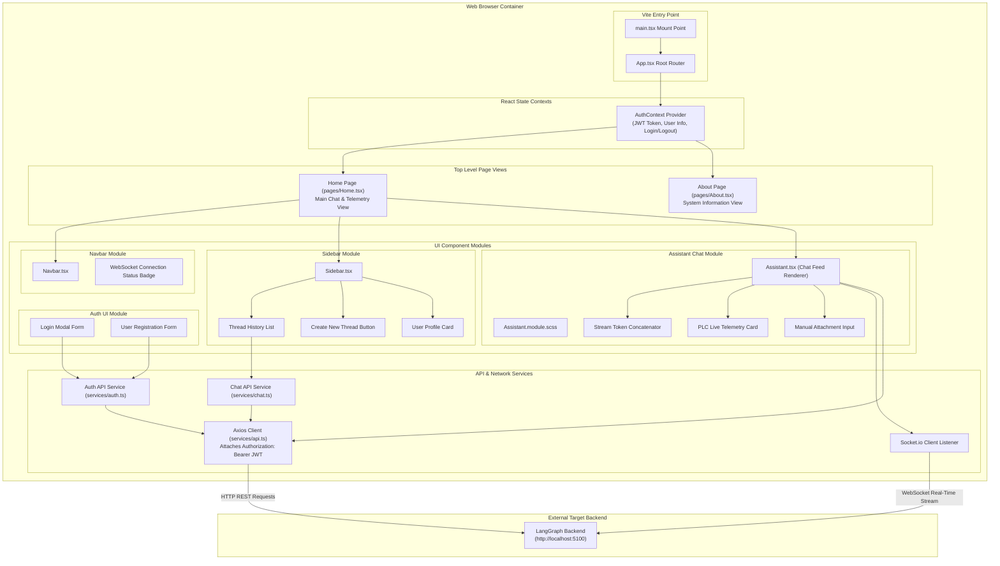
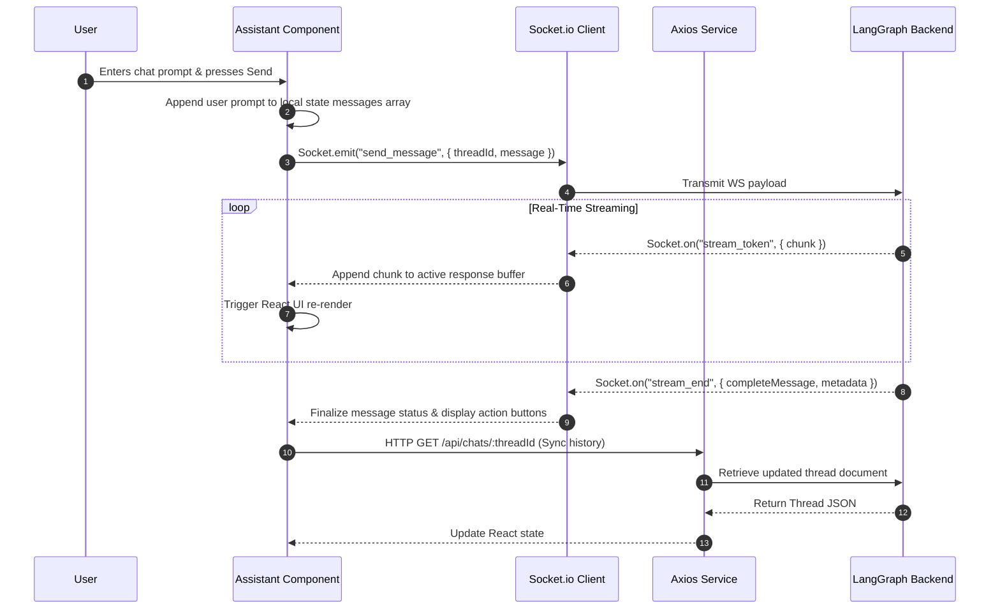

# Application Architecture: Plixy Frontend

This document details the internal architecture, UI component structure, state management, module flows, and service integrations for **Plixy Frontend**.

---

## 1. Overview & Tech Stack

- **Application Type**: Single Page Application (SPA) Web Frontend
- **Framework**: React 18 with TypeScript
- **Build System**: Vite 5
- **Styling**: SCSS Modules (`*.module.scss`)
- **Routing**: React Router DOM v6
- **Real-Time Client**: Socket.io Client (`socket.io-client`)
- **HTTP Client**: Axios
- **Micro-Frontend Support**: `@originjs/vite-plugin-federation`

---

## 2. Internal Module Architecture Diagram



---

## 3. Basic Level Flow: Streaming Chat Interaction



---

## 4. Key Directory Structure

```
Plixy_frontend/
├── src/
│   ├── assets/              # Static media & SVG icons
│   ├── components/
│   │   ├── Assistant/       # Core Chat Interface & Streaming Renderer
│   │   ├── Auth/            # Authentication UI & Context
│   │   ├── Navbar/          # Global Header Navigation
│   │   ├── Sidebar/         # Dynamic Thread History & Navigation
│   │   ├── UserRegistration/# User management & registration forms
│   │   └── common/          # Reusable Buttons, Inputs, Loaders
│   ├── hooks/               # Custom React hooks (useSocket, useAuth)
│   ├── pages/               # Top-level Page Views (Home, About)
│   ├── services/            # API clients (api.ts, auth.ts, chat.ts)
│   ├── styles/              # Global variables, mixins, & resets
│   ├── App.tsx              # Root React component
│   └── main.tsx             # DOM Mount Entry Point
└── vite.config.ts           # Vite build config
```

---

## 5. External Services Utilized

- **LangGraph Backend** (`http://localhost:5100`): Provides authentication, chat thread persistence, document extraction triggers, and Socket.io WebSockets token streaming.
