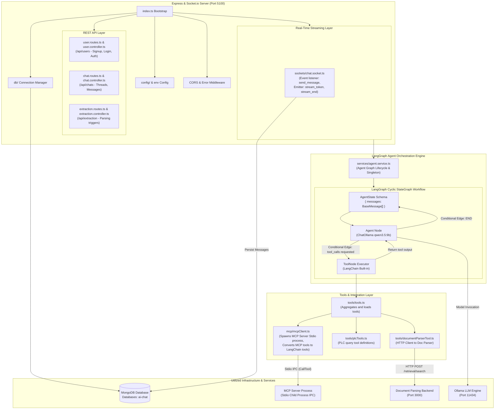
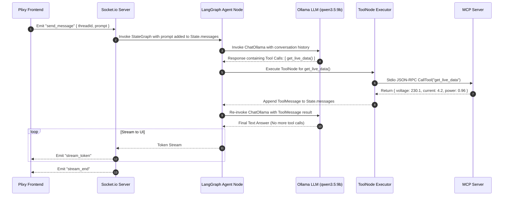

# Application Architecture: LangGraph Backend

This document details the internal architecture, LangGraph state graph workflow, tool execution engine, MCP client bridge, and service integrations for **LangGraph Backend**.

---

## 1. Overview & Tech Stack

- **Runtime**: Node.js with TypeScript (`tsx watch`)
- **Web Framework**: Express.js
- **Agentic Engine**: `@langchain/langgraph` & `@langchain/core`
- **LLM Integration**: `@langchain/ollama` (`ChatOllama`)
- **Protocol Client**: `@modelcontextprotocol/sdk` (Stdio Client)
- **Database ORM**: Mongoose (`mongodb`)
- **Real-Time Streaming**: Socket.io Server

---

## 2. Internal Module Architecture Diagram



---

## 3. Basic Level Flow: Agent StateGraph Loop & Tool Execution



---

## 4. Key Directory Structure

```
LangGraph_backend/
├── src/
│   ├── agent/               # LangGraph StateGraph definition
│   │   └── agent.ts         # Agent graph creation, node edges, & state schema
│   ├── config/              # Environment & application configurations
│   ├── controllers/         # REST API Controllers (User, Chat, Extraction)
│   ├── db/                  # Mongoose connection & Database Models (User, Chat)
│   ├── mcp/                 # MCP Client connector
│   │   └── mcpClient.ts     # Spawns MCP Server process over Stdio transport
│   ├── routes/              # Express API Routes
│   ├── services/            # Agent lifecycle & Chat business logic
│   ├── sockets/             # Socket.io chat streaming event handlers
│   ├── tools/               # Registered LangChain tools
│   │   ├── tools.ts         # Tool aggregator & dynamic tool loader
│   │   └── documentParserTool.ts
│   ├── utils/               # Ollama model checkers & helpers
│   └── index.ts             # Application entry point & server bootstrap
```

---

## 5. External Services Utilized

- **MCP Server** (Stdio IPC): Execution of live PLC hardware and InfluxDB time-series analysis tools.
- **Document Parsing Backend** (`http://document_parsing_backend:3000`): Semantic document search (`/retrieval/search`).
- **MongoDB** (`mongodb://mongodb:27017/ai-chat`): User auth profiles, chat threads, and message history.
- **Ollama Engine** (`http://192.168.2.210:11434`): Text generation LLMs (`qwen3.5:9b`, `llama3.1:8b`).
