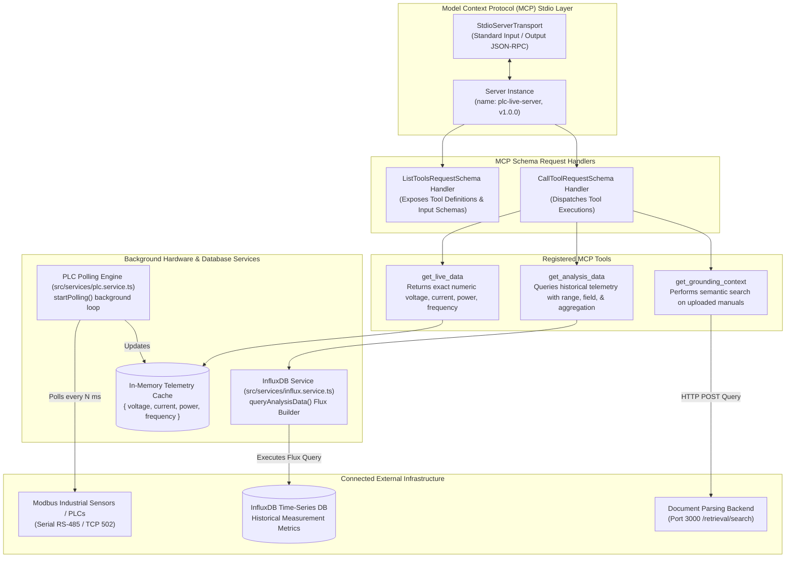
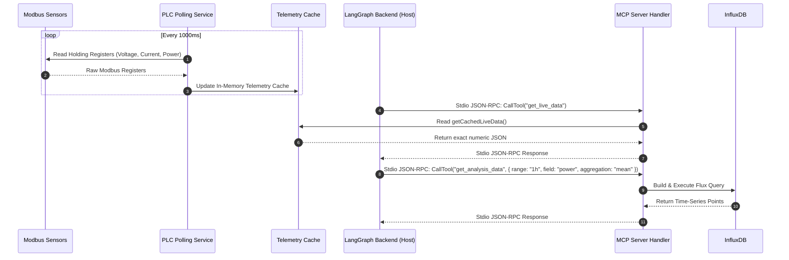

# Application Architecture: MCP Server

This document details the internal architecture, Model Context Protocol (MCP) server implementation, tool handlers, background hardware polling engines, and database integrations for **MCP Server**.

---

## 1. Overview & Tech Stack

- **Runtime**: Node.js with TypeScript (`ts-node`)
- **Protocol Core**: `@modelcontextprotocol/sdk`
- **IPC Transport**: `StdioServerTransport` (Standard input/output IPC)
- **Industrial Protocol**: `modbus-serial` (Modbus RTU / TCP)
- **Time-Series Client**: `@influxdata/influxdb-client`
- **Validation**: `zod` schema validation

---

## 2. Internal Module Architecture Diagram



---

## 3. Basic Level Flow: Modbus Polling & Tool Request Dispatch



---

## 4. Key Directory Structure

```
MCP_Server/
├── src/
│   ├── config/              # Environment constants & database URIs
│   ├── services/            # Background hardware & DB engines
│   │   ├── plc.service.ts   # Modbus polling loop & in-memory cache
│   │   └── influx.service.ts# InfluxDB flux queries & data formatting
│   ├── tools/               # Tool schema definitions & helper utilities
│   ├── utils/               # Modbus serial helpers & math utilities
│   └── index.ts             # Server entry point, MCP handlers, & stdio connection
```

---

## 5. External Services Utilized

- **Modbus Industrial Sensors / PLCs** (Serial / TCP Port 502): Polling physical electrical measurements.
- **InfluxDB** (`http://localhost:8086`): Historical time-series telemetry storage and Flux query execution.
- **Document Parsing Backend** (`http://document_parsing_backend:3000`): Grounding context semantic search.
- **LangGraph Backend**: Host process invoking tools over Stdio standard input/output.
