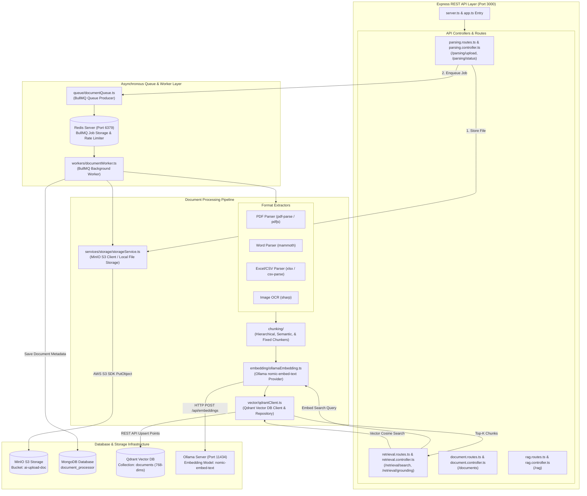
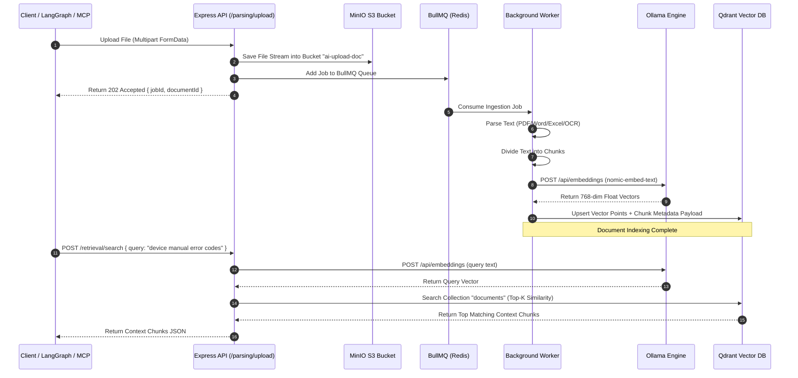

# Application Architecture: Document Parsing Backend

This document details the internal architecture, multi-format ingestion pipeline, asynchronous job queues, vector embedding engine, and storage integrations for **Document Parsing Backend**.

---

## 1. Overview & Tech Stack

- **Runtime**: Node.js with TypeScript (`tsx watch`)
- **Web Framework**: Express.js with Helmet & Rate Limiting
- **Async Job Queue**: BullMQ with Redis (`ioredis`)
- **Vector Database**: Qdrant (`@qdrant/js-client-rest`)
- **Object Storage**: MinIO / S3 (`@aws-sdk/client-s3`)
- **Metadata Database**: MongoDB (`mongoose`)
- **Document Extractors**: `pdfjs-dist`, `pdf-parse`, `mammoth` (DOCX), `sharp` (OCR), `csv-parse`, `xlsx`
- **Embedding Model**: Ollama (`nomic-embed-text`, 768 dimensions)

---

## 2. Internal Module Architecture Diagram



---

## 3. Basic Level Flow: Ingestion Pipeline & Retrieval



---

## 4. Key Directory Structure

```
document_parsing_backend/
├── src/
│   ├── app.ts               # Express application configuration & routes mounting
│   ├── server.ts            # HTTP server startup & database initialization
│   ├── chunking/            # Chunking algorithms (hierarchical, fixed, semantic)
│   ├── controllers/         # REST API Controllers (Parsing, Retrieval, Documents)
│   ├── embedding/           # Ollama embedding generator client
│   ├── models/              # Mongoose database models (Document, ProcessingJob)
│   ├── ocr/                 # OCR preprocessing utilities
│   ├── parsers/             # Document format parsers (PDF, DOCX, CSV, XLSX, Image)
│   ├── processing/          # Core processing pipeline orchestrator
│   ├── queue/               # BullMQ queue producer setup
│   ├── rag/                 # RAG context formatting and grounding engine
│   ├── retrieval/           # Vector retrieval service & rankers
│   ├── routes/              # Express API route declarations
│   ├── services/storage/    # Storage abstraction (MinIO S3 Client & Local Storage)
│   ├── vector/              # Qdrant client connection & collection management
│   └── workers/             # BullMQ background worker definitions
```

---

## 5. External Services Utilized

- **Redis** (`redis:6379`): Job queue processing via BullMQ and Express rate limiting.
- **MongoDB** (`mongodb://mongodb:27017/document_processor`): Document metadata, processing job history, and document status tracking.
- **Qdrant Vector DB** (`http://qdrant:6333`): Vector index storage (`documents` collection) and cosine similarity retrieval.
- **MinIO S3 Storage** (`http://192.168.2.213:9998`): Storing original raw document files in bucket `ai-upload-doc`.
- **Ollama Engine** (`http://192.168.2.210:11434`): Vector embedding generation using `nomic-embed-text`.
