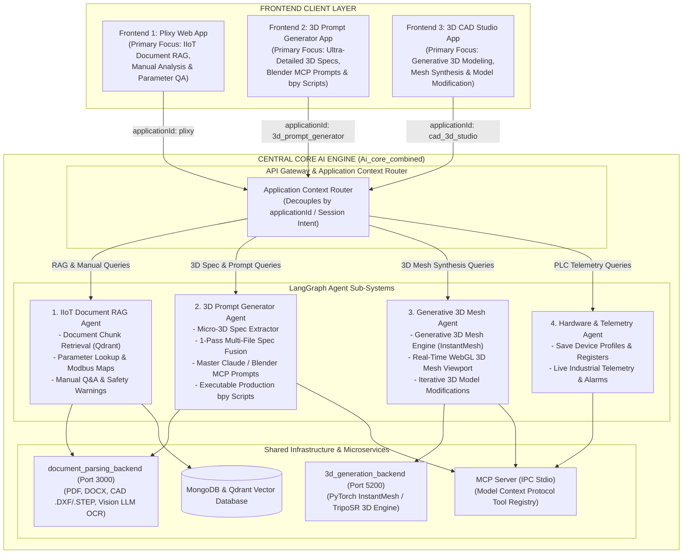

# Multi-Frontend Core AI Engine Architecture

This document defines the decoupled **Headless Central Core AI Engine** architecture for `Ai_core_combined`, serving multiple specialized client applications over clean REST and WebSocket APIs.

---

## 1. Multi-Frontend Ecosystem Overview



---

## 2. Specialized Application Roles

### Application 1: **Plixy (IIoT Document & Manual RAG Assistant)**
- **Primary Objective**: Analyze uploaded manuals, schematics, datasheets, and guides to solve user queries.
- **Key Features**:
  - Semantic vector search across uploaded PDF, Word, Excel, and image documents.
  - Modbus register map extraction and parameter verification.
  - Safety warning alerts and installation instructions.
  - Image/diagram rendering for rear panels and wiring schematics.

### Application 2: **3D Prompt Generator (3D CAD Prompt Engine Web App)**
- **Primary Objective**: Analyze uploaded device manuals, technical blueprints, CAD files (`.dxf`, `.step`), and photos to produce **ultra-detailed 3D model prompts, technical specification tables, and production Blender Python (`bpy`) scripts** for constructing highly accurate 3D device models.
- **Key Features**:
  - Micro-detail 3D CAD parameter extraction ($W \times H \times D$, chamfer radii, DIN rail $35\text{mm}$ channel, bezel thickness).
  - 1-Pass Multi-File Fusion (cross-validating CAD drawings, photos, and PDF specs in a single pass).
  - Master copy-pasteable **Claude / Blender MCP Prompt** generation.
  - Production **Blender Python (`bpy`) script** building (collections, primitives, bevel modifiers, screen optics, PBT green terminal arrays).
  - Markdown specs table generation with LoD rating and completeness score.

### Application 3: **3D CAD Studio App (Generative 3D Modeling & Modification App)**
- **Primary Objective**: Direct 3D mesh model generation (`.GLB`, `.OBJ`), real-time WebGL 3D viewport preview, and iterative 3D model modifications based on user prompts.
- **Key Features**:
  - Generative 3D mesh model generation (`InstantMesh` / `TripoSR` backend).
  - Interactive Three.js WebGL viewport rendering in the browser.
  - Iterative 3D mesh modifications (e.g. *"Increase button diameter to 8mm"*, *"Change body material to brushed aluminum"*).
  - 1-click 3D mesh file downloads (`.GLB` / `.OBJ`).

---

## 3. Core AI Engine Decoupling Protocol

Frontends pass an `applicationId` or `contextMode` header in WebSocket and REST connections:

```json
{
  "applicationId": "3d_prompt_generator",
  "chatId": "thread-9821",
  "message": "Generate ultra-detailed 3D model prompt for the Hexa-Series EM6400 device"
}
```

The Central AI Engine routes the payload to the specialized agent worker while leveraging shared databases (MongoDB, Qdrant) and microservices (`document_parsing_backend`, `MCP_Server`, `3d_generation_backend`).
