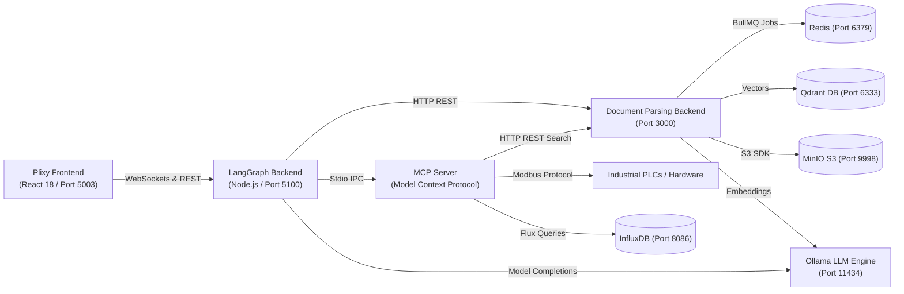

# AI Industrial Assistant Platform - Architecture Documentation

Welcome to the centralized architecture documentation repository for the **AI Industrial Assistant Platform**. This directory contains comprehensive visual **Mermaid diagrams** and technical specifications detailing the overall system topology and internal application module workflows.

---

## 📚 Architecture Documentation Index

| Module / Scope | Document Link | Description |
| :--- | :--- | :--- |
| **Master System Architecture** | [00_OVERALL_SYSTEM_ARCHITECTURE.md](file:///c:/Users/Gabriel/Documents/Ai_core_combined/docs/architecture/00_OVERALL_SYSTEM_ARCHITECTURE.md) | Comprehensive master architecture diagram detailing all 4 applications, internal modules, background workers, databases, hardware interfaces, and basic data flows. |
| **Plixy Frontend** | [01_PLIXY_FRONTEND_ARCHITECTURE.md](file:///c:/Users/Gabriel/Documents/Ai_core_combined/docs/architecture/01_PLIXY_FRONTEND_ARCHITECTURE.md) | React 18 / Vite / SCSS component hierarchy diagram, Socket.io real-time streaming workflow, auth context, and API integration. |
| **LangGraph Backend** | [02_LANGGRAPH_BACKEND_ARCHITECTURE.md](file:///c:/Users/Gabriel/Documents/Ai_core_combined/docs/architecture/02_LANGGRAPH_BACKEND_ARCHITECTURE.md) | LangGraph `StateGraph` agentic execution loop diagram, Express/Socket.io server, Stdio MCP client wrapper, and LLM integrations. |
| **MCP Server** | [03_MCP_SERVER_ARCHITECTURE.md](file:///c:/Users/Gabriel/Documents/Ai_core_combined/docs/architecture/03_MCP_SERVER_ARCHITECTURE.md) | Model Context Protocol (MCP) server design diagram, tool definitions (`get_live_data`, `get_analysis_data`, `get_grounding_context`), background Modbus PLC poller, and InfluxDB integration. |
| **Document Parsing Backend** | [04_DOCUMENT_PARSING_BACKEND_ARCHITECTURE.md](file:///c:/Users/Gabriel/Documents/Ai_core_combined/docs/architecture/04_DOCUMENT_PARSING_BACKEND_ARCHITECTURE.md) | Async document ingestion pipeline diagram, BullMQ/Redis task queue, multi-format parsers (PDF, Word, Excel, CSV, Image OCR), Qdrant vector store indexing, and MinIO S3 object storage integration. |
| **Multi-Frontend Core AI Engine** | [05_MULTI_FRONTEND_CORE_AI_ENGINE_ARCHITECTURE.md](file:///c:/Users/Gabriel/Documents/Ai_core_combined/docs/architecture/05_MULTI_FRONTEND_CORE_AI_ENGINE_ARCHITECTURE.md) | Decoupled Headless Core AI Engine architecture serving Plixy (IIoT Document RAG) and Future 3D CAD Studio App over unified REST & WebSocket APIs. |

---

## 🛠️ System Overview Summary

