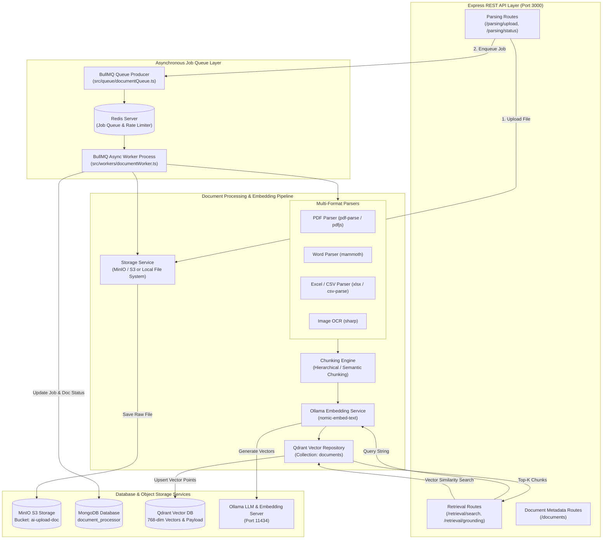

# Document Parsing Backend - Application Architecture

This document details the internal architecture, multi-format ingestion pipeline, asynchronous job queues, vector embedding engine, and database integrations for **Document Parsing Backend**.

---

## 1. Overview & Technology Stack

**Document Parsing Backend** is a production-grade document processing and retrieval framework. It handles document upload, OCR/text extraction, intelligent chunking, vector embedding, Qdrant indexing, and high-performance semantic retrieval (RAG).

- **Runtime**: Node.js with TypeScript (`tsx watch`)
- **Web Framework**: Express.js with Helmet & Rate Limiting
- **Async Task Queue**: BullMQ with Redis (`ioredis`)
- **Vector Database**: Qdrant (`@qdrant/js-client-rest`)
- **Object Storage**: MinIO / S3 (`@aws-sdk/client-s3`)
- **Metadata Database**: MongoDB (`mongoose`)
- **Document Parsers**: `pdfjs-dist`, `pdf-parse`, `mammoth` (DOCX), `sharp` (Images/OCR), `csv-parse`, `xlsx`
- **Embedding Provider**: Ollama (`nomic-embed-text`, 768 dimensions)

---

## 2. Internal Architecture Diagram



---

## 3. Directory Structure & Key Modules

```
document_parsing_backend/
├── src/
│   ├── app.ts               # Express application configuration & routes mounting
│   ├── server.ts            # HTTP server startup & database initialization
│   ├── chunking/            # Chunking algorithms (hierarchical, fixed, semantic)
│   ├── controllers/         # REST API Controllers (Parsing, Retrieval, Documents)
│   ├── embedding/           # Ollama embedding generator client
│   ├── models/              # Mongoose database models (Document, ProcessingJob)
│   ├── ocr/                 # OCR preprocessing utilities
│   ├── parsers/             # Document format parsers (PDF, DOCX, CSV, XLSX, Image)
│   ├── processing/          # Core processing pipeline orchestrator
│   ├── queue/               # BullMQ queue producer setup
│   ├── rag/                 # RAG context formatting and grounding engine
│   ├── retrieval/           # Vector retrieval service & rankers
│   ├── routes/              # Express API route declarations
│   ├── services/storage/    # Storage abstraction (MinIO S3 Client & Local Storage)
│   ├── vector/              # Qdrant client connection & collection management
│   └── workers/             # BullMQ background worker definitions
├── Dockerfile               # Container build instructions
└── package.json             # Node.js dependencies
```

---

## 4. Processing Pipeline & RAG Workflow

### 4.1 Asynchronous Document Ingestion Pipeline
1. **Upload**: API receives document upload via `/parsing/upload`.
2. **Raw File Persist**: Uploaded file is streamed into **MinIO S3** (`ai-upload-doc` bucket).
3. **Enqueue Job**: A `DocumentProcessingJob` record is saved in **MongoDB** and added to **BullMQ / Redis** queue.
4. **Text Extraction**: **BullMQ Worker** routes the document to the corresponding parser:
   - PDFs -> `pdf-parse` / `pdfjs-dist`
   - DOCX -> `mammoth`
   - Excel / CSV -> `xlsx` / `csv-parse`
   - Images -> `sharp` preprocessing
5. **Chunking**: Text is split into chunks with overlap and position metadata.
6. **Vector Generation**: Text chunks are sent to **Ollama** (`/api/embeddings` model `nomic-embed-text`) returning 768-dimensional float arrays.
7. **Vector Indexing**: Chunks and vectors are stored in **Qdrant** collection `documents`.

### 4.2 Semantic Search & Retrieval (`/retrieval/search`)
1. Accepts search query string and optional filters.
2. Converts query string into a 768-dimensional vector using **Ollama**.
3. Performs Cosine Similarity vector search against **Qdrant** vector points.
4. Returns top matching text chunks with source page references, chunk IDs, and similarity scores.

---

## 5. Applications & External Services Utilized

| Service / Infrastructure | Connection Type | Target / Endpoint | Purpose |
| :--- | :--- | :--- | :--- |
| **Redis** | ioredis | `redis:6379` | Background BullMQ task queue management and rate limiting. |
| **MongoDB** | Mongoose Driver | `mongodb://mongodb:27017/document_processor` | Tracking document processing status, metadata, and chunk counts. |
| **Qdrant Vector DB** | REST Client | `http://qdrant:6333` | Storing 768-dimensional vector embeddings and performing similarity search. |
| **MinIO / S3 Storage** | AWS S3 SDK | `http://192.168.2.213:9998` | Storing original raw document files in `ai-upload-doc` bucket. |
| **Ollama LLM Engine** | HTTP REST | `http://192.168.2.210:11434` | Generating text embeddings using `nomic-embed-text`. |
